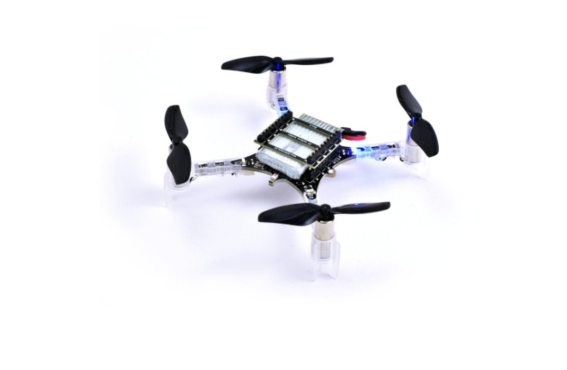
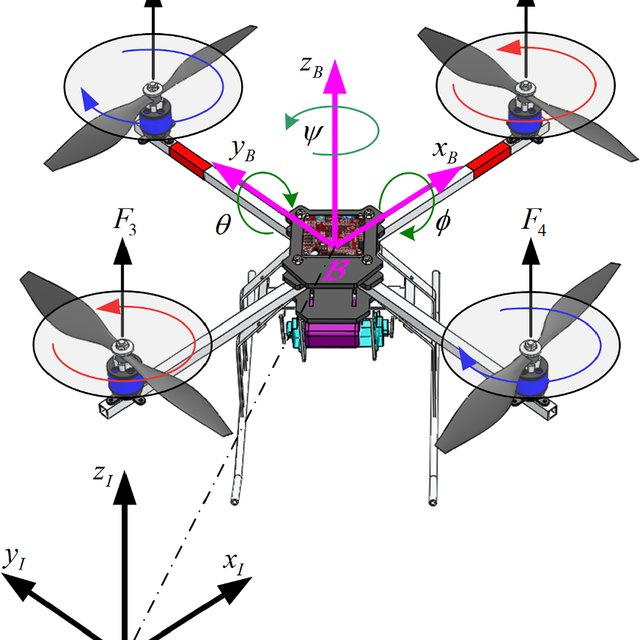
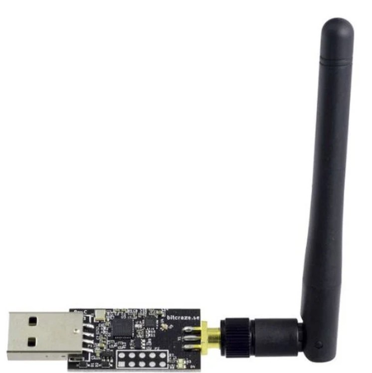

# Making Crazyflies Crazy 🚁

This repository contains the code, documentation, and results for implementing a **real-time control system** on the **Crazyflie 2.1 nano quadrotor** using the **TinyMPC** solver. The project demonstrates real-time Model Predictive Control (MPC) capabilities on resource-constrained hardware with a baseline demo.

---

## 👥 Team

- Vahid Faraji  
- Wang TianCi  
- Cai Yaliang  
- Zu Haobo  
- Hao Changsheng  
**Advisor:** Jia Zheng

---

## 🎯 Project Objectives

The goal of this project is to integrate the **TinyMPC solver** into the Crazyflie firmware, enabling onboard solution of an MPC problem based on a **linearized 6-DOF dynamics model**. The controller is validated through a **baseline demo** involving:

- **Real-Time Control Implementation** at ~500 Hz loop frequency
- **Figure-8 trajectory tracking**
- **Recovery from extreme initial conditions**

This serves as a practical platform for studying **optimization, control, and embedded systems**.

---

## 🛠️ System Setup

### Hardware
- **Crazyflie 2.1:** 27g nano quadrotor with 4 motors and Cortex-M4 STM32F405 MCU
- **Crazyradio PA:** USB radio dongle for host-PC communication
- **Lighthouse Positioning System:** Accurate 6-DoF localization
- **Battery and charger:** 3.7V LiPo battery pack

### Software
- **TinyMPC:** Lightweight QP solver for onboard real-time MPC (written in C++)
- **Python & MATLAB APIs:** Used for trajectory generation, simulation, and communication
- **Bitcraze firmware:** Customized to support TinyMPC controller running in a separate thread

---
## 📸 Screenshots

## 🎬 Demo Videos

- [▶️ Attach the battery](media/attach_the_battery.mp4)
- [▶️ Power on sequence](media/power_on.mp4)
- [▶️ Normal flight demo](media/normal_flight.mp4)

---

## 📐 Modeling & Control Design

### 6-DOF Linearized Model
- Based on small-angle approximations around **hover equilibrium**
- Linear state-space form: 𝑥̇ = 𝐴𝑥 + 𝐵𝑢
- Captures dynamics for **attitude stabilization** and **trajectory tracking**

### State & Input
- **State vector (x ∈ ℝ¹²):** 3D position, velocity, orientation (quaternion), angular velocity
- **Input vector (u ∈ ℝ⁴):** PWM values for 4 motors

### MPC Formulation
- **Objective:** Minimize tracking error + control effort
- **Constraints:**
  - Input (PWM range per motor)
  - State (safety bounds on angle and position)
- Solved as a **convex quadratic program (QP)**

### Solver: TinyMPC + ADMM
- Uses **Alternating Direction Method of Multipliers (ADMM)**
- Efficient for real-time execution on microcontrollers
- Allows **primal-dual optimization** with fast convergence

---
## 📁 Repository Structure

crazyflie-tinympc/ ├── docs/ # Project reports (PDFs) ├── firmware/ # TinyMPC firmware integration ├── scripts/ # Python/MATLAB control and simulation scripts ├── models/ # Dynamics modeling and linearization ├── results/ # Collected flight or simulation results ├── presentation/ # Project presentations (e.g., Feedback seminar) ├── README.md ├── LICENSE └── .gitignore

Copy
Edit

---

## 🤝 Contributions

This repository is maintained by the project group. Feel free to fork or open issues for discussion.
